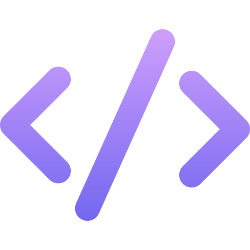

<h1 align="center">
    
  <b>DevSolve Club Website</b>
</h1>

  🌟 The official online platform for our <b>project-based, problem-solving club</b> 🌟  

---

## 📌 Overview
The **DevSolve Club Website** is the digital hub for our community of problem solvers.  
It serves as the central platform for:  
- 📖 **Club information**  
- 📜 **Guidelines and rules for joining**  
- 🧑‍🎓 **Separate registration for Juniors and Seniors**  
- 🌱 **Showcasing our mission and values**

The website will **grow alongside the club**, starting as a simple platform and evolving into a **full-featured project hub**.

---

## 🎯 Purpose
Our motto is **"Learn by Doing"** — we believe true growth comes from **building, collaborating, and solving real-world challenges**.  

This website aims to:  
✅ Introduce the club to potential members  
✅ Provide a smooth registration process  
✅ Communicate structure, rules, and conduct  
✅ Serve as a foundation for future tools & resources  

---

## 🚀 Current Features
- 🏠 **Home page** with mission and values  
- 📜 **Club rules** and joining guidelines  
- 🧑‍💻 **Separate registration forms** for Juniors & Seniors  
- 📬 **Contact details** for the club  

---

## 🔮 Future Goals
We plan to expand the platform with:  
1. 👤 **Member Dashboard** – Personal and project progress tracking  
2. 📂 **Live Project List** – Showcase ongoing & completed projects  
3. 💬 **Discussion Board** – Internal communication & collaboration  
4. 📚 **Resource Library** – Learning materials & documentation  
5. 🔗 **Appwrite Integration** – Authentication, member management, storage  

📌 For a detailed roadmap, check [ISSUES.md](ISSUES.md).  

---

## 🛠 Tech Stack (Planned)

  
  
  
  

---

## 🤝 Contributing
We ❤️ contributions from our members and the wider developer community.  

- Read our [CONTRIBUTING.md](CONTRIBUTING.md) before contributing.  
- Explore [ISSUES.md](ISSUES.md) for tasks & feature requests.  

---

## 📄 License
📜 This project is licensed under the terms described in the [LICENSE](LICENSE) file.  

---

## 📬 Contact
- 📧 **Email:** ---@gmail.com  
- 🏫 **College:** [Your College Name]  
- 📍 **Location:** [City, State]  

---

  🚀 Built and maintained by <b>DevSolve Club Members</b>  

